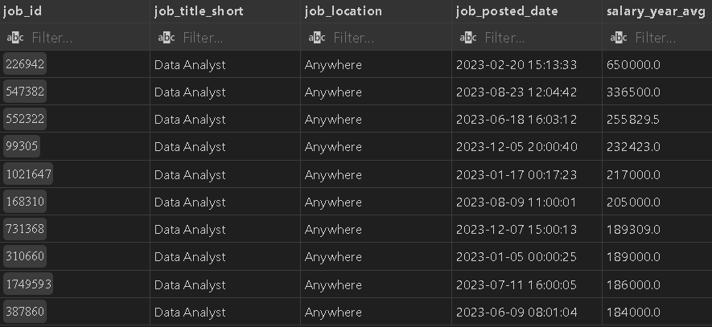
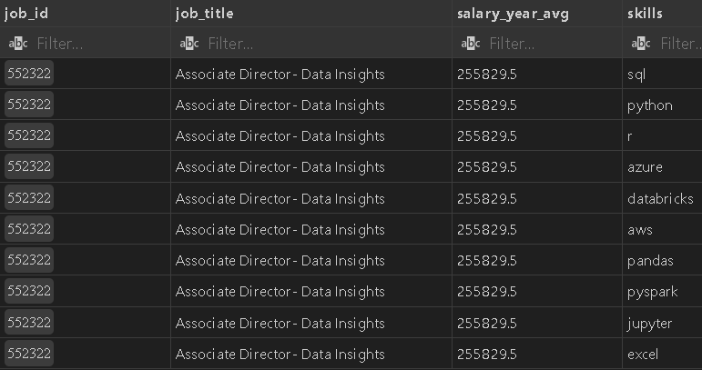
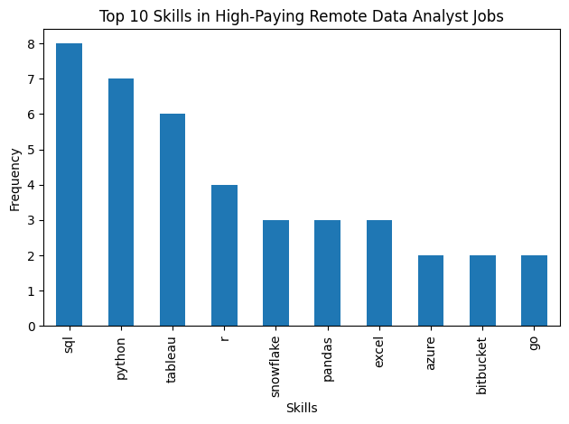
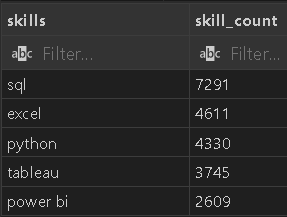
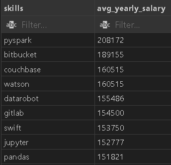
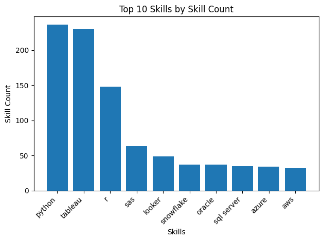

# 📊 SQL Data Analysis Project

## 🧠 Project Overview
This project analyzes job market data using **SQL** to answer practical career-related questions around salaries and skills. 

The goal is to identify:
- 💰 High-paying roles
- 🛠️ Skills required for top-paying jobs
- 📈 Most in-demand skills
- 🎯 Skills that are both high-paying and high-demand

The analysis is performed using **5 SQL queries**, each answering one focused question.

📂 **All SQL Queries (Project Folder):**  
👉 [View all SQL query files](/project_sql/)

---

## 🧰 Tools Used
- 💻 **VS Code** – SQL development and result visualization
- 🗄️ **PostgreSQL** – Primary database engine
- 🧪 **SQLite** – Practice and query validation
- 🌱 **Git & GitHub** – Version control and project sharing

---

## 🧩 Skills Used
- 🟦 **SQL**
  - `JOIN`, `GROUP BY`, `ORDER BY`
  - Aggregate functions (`AVG`, `COUNT`)
  - Subqueries & CTEs
- 🐘 **PostgreSQL**
  - Analytical querying
- 📊 **Data Analysis**
  - Market trend interpretation
  - Skill-to-salary evaluation

---

## 🔍 Detailed Analysis – SQL Queries

### 1️⃣ Top Paying Jobs
❗ **Question:** What are the top-paying jobs for data analyst role?

📄 **SQL File:**  
[top paying jobs](/project_sql/1_top_paying_jobs.sql)

#### 🔎 What I did in this query?
- 🏁 Identified the top 10 highest-paying Data Analyst roles that are available Anywhere (remote).
- 🧩 Focused only on job postings with specified salaries (excluding null salary values).
- 🎯 Why? This highlights the top-paying opportunities for Data Analysts and provides insight into employment trends for high-compensation roles.

#### 💡 Key Insight
- 🔝 Most high-paying roles cluster between **$180K–$250K**
- 💰 Highest-paying roles are offered by **tech, finance, and data-driven companies**
- ⚠️ Despite the generic title “Data Analyst,” salary levels indicate **senior or highly specialized roles**

🟦 **Result:**  
> ✅ Remote data analyst positions can offer extremely competitive compensation, especially for experienced professionals with specialized skills.

### 🧾 SQL Query Used

```sql
SELECT
    job_id,
    job_title_short,
    job_location,
    job_posted_date,
    salary_year_avg,
    name as company_name
FROM job_postings_fact
LEFT JOIN company_dim
ON job_postings_fact.company_id = company_dim.company_id
WHERE job_title_short = 'Data Analyst' AND
    job_location = 'Anywhere' AND
    salary_year_avg is NOT NULL
ORDER BY salary_year_avg DESC
LIMIT 10;
```
📸 **Result Snapshot:**  




---

### 2️⃣ Skills Required for Top Paying Jobs
❗ **Question:** What skills are required for these top-paying Data Analyst role?

📄 **SQL File:**  
[top paying job skills](project_sql/2_top_paying_job_skills.sql)

📊 **CSV Output:**  
[Top skills Data Insight excel](project_queries/query_2.csv)

#### 🔎 What I did in this query?
- 📌 Used the top 10 highest-paying Data Analyst jobs identified in the first query.
- 🧪 Added the specific skills required for these roles.
- 🐘 Why? This provides a detailed view of which skills are most in demand for high-paying Data Analyst positions, helping job seekers understand which skills to develop to align with top salaries.

#### 💡 Key Insight
- 📈 SQL is the most essential skill — it appears across almost all roles.
- ⭐ Python (and Pandas) + R show that analysts are expected to do real data manipulation, not just reporting.
- 💡 Tableau highlights strong demand for data visualization and stakeholder communication.
- 🖥️ Snowflake & Azure indicate a clear shift toward cloud-based data analytics.
- 🌱 Mentions of Bitbucket / Go suggest analyst roles are slowly blending with engineering workflows.

🟦 **Result:**
> Modern data analysts are expected to combine database querying, programming, visualization, and basic cloud knowledge — the role is broader and more technical than in the past.

### 🧾 SQL Query Used

```sql
WITH top_10_jobs as(
    SELECT
        job_id,
        job_title,
        salary_year_avg
    FROM job_postings_fact
    LEFT JOIN company_dim
    ON job_postings_fact.company_id = company_dim.company_id
    WHERE job_title_short = 'Data Analyst' AND
        job_location = 'Anywhere' AND
        salary_year_avg is NOT NULL
    ORDER BY salary_year_avg DESC
    LIMIT 10
)
SELECT top_10_jobs.*,
    skills_dim.skills
FROM top_10_jobs
INNER JOIN skills_job_dim
    ON top_10_jobs.job_id = skills_job_dim.job_id
INNER JOIN skills_dim
    ON skills_dim.skill_id = skills_job_dim.skill_id
ORDER BY top_10_jobs.salary_year_avg DESC;

```
📸 **Result Snapshot:**  


---

### 📊 Query 2 – Skill Frequency Visualization
*(Based on `Top skills Data Insight.csv`)*
- 📈 This graph visualizes how top skills appears in top-paying roles
- 📊 Helps identify **must-have skills** for higher salaries

📈 **Graph Placeholder:**



📝
***Skills appearing most frequently indicate stronger alignment with high-paying positions.***

---

### 3️⃣ Most In-Demand Skills
❗ **Question:** What are the most in-demand skills?

📄 **SQL File:**  
[top demanding skills](project_sql/3_top_demanded_skills.sql)

#### 🔎 What I did in this query?
- 🔧 Joined job postings to inner join table similar to query 2
- 🗄️ Identifed the top 5 in-demand skills i.e. **skills with highest job count** for data analyst role.
- 🖼️ Focused on all job postings.
- 💡 Why? Retrieves the top 5 skills with the highest demand in the job market, providing insights into the most valuable skills for job seekers.


#### 💡 Key Insight
- 🧠 **SQL** and **Excel** are by far the most in-demand skills, appearing in the majority of job postings
- 📌 **Python** ranks close behind, highlighting the growing need for automation and advanced analytics
- 🛠️ **Tableau** and **Power BI** confirm strong demand for data visualization skills

### 🧾 SQL Query Used

```sql
SELECT skills,
    COUNT(skills_job_dim.job_id) as skill_count
FROM job_postings_fact
INNER JOIN skills_job_dim
    ON skills_job_dim.job_id = job_postings_fact.job_id
INNER JOIN skills_dim
    ON skills_job_dim.skill_id = skills_dim.skill_id
WHERE job_title_short = 'Data Analyst' AND
    job_work_from_home = TRUE
GROUP BY skills
ORDER BY skill_count DESC
LIMIT 5;
```

📸 **Result Snapshot:**  



---

### 4️⃣ Top Paying Skills
❗ **Question:** What skills are associated with the highest salaries for data analyst role?

📄 **SQL File:**  
[top paying skills](project_sql/4_top_paying_skills.sql)

#### 🔎 What I did in this query?
- ⭐ Looked at the avg salary for each skill associated with data analyst position
- 🚀 Focused on roles with specified salaries regardless of location
- ✅ Why? It reveals how different skills impavct the salary as it helps identifying the most finacially rewarding skills

#### 💡 Key Insight
- 🧱 Skills like PySpark, Databricks, Airflow, Kubernetes indicate that big data & data engineering overlap pays more.
- 🚀 Python ecosystem skills (Pandas, NumPy, Jupyter, scikit-learn) still command strong salaries, showing analytics + ML capability is valued.
- 🧾 DevOps & tooling skills (GitLab, Jenkins, Linux, Atlassian) boost pay, signaling demand for analysts who can work in production environments.
- 💡 Cloud & platform skills (GCP, Databricks) consistently sit above $120k, reinforcing cloud literacy as a salary driver.
- 📊 Classic analytics tools (PostgreSQL, MicroStrategy) pay well but less than hybrid/engineering skills.

🟦 **Result:**
> 🎨 The highest salaries go to data analysts who blend analytics with engineering, automation, and cloud skills, not those limited to reporting or dashboards.

### 🧾 SQL Query Used
```sql
SELECT skills,
    Round(Avg(job_postings_fact.salary_year_avg),0) as avg_yearly_salary
FROM job_postings_fact
INNER JOIN skills_job_dim
    ON skills_job_dim.job_id = job_postings_fact.job_id
INNER JOIN skills_dim
    ON skills_job_dim.skill_id = skills_dim.skill_id
WHERE job_title_short = 'Data Analyst'
    AND salary_year_avg IS NOT NULL
    AND job_work_from_home = TRUE
GROUP BY skills
ORDER BY avg_yearly_salary DESC
LIMIT 25;
```

📸 **Result Snapshot:**  



---

### 5️⃣ Most Optimal Skills to Learn
❗ **Question:** What are the most optimal skills to learn (aka it’s in high demand and a high-paying skill)?

📄 **SQL File:**  
[top optimal skills](project_sql/5_top_optimal_skills.sql)

#### 🔎 What I did in this query?
- ✔️ Identified skills in high demand and associated with high average salaries for Data Analyst roles
- 🔝 Concentrated on remote positions with specified salaries
- 💼 Why? Targets skills that offer job security (high demand) and financial benefits (high salaries), offering strategic insights for career development in data analysis

#### 💡 Key Insight
- 🎯 The highest average salaries are linked to **specialized and less common skills** such as Go, Hadoop, Snowflake, and cloud platforms
- 📈 Skills with **lower frequency** often command **higher pay**, indicating a scarcity premium
- 💰 Popular tools like **Python, R, and Tableau** show strong demand but slightly lower average salaries
- 🌍 Cloud, big data, and enterprise tools consistently rank among the **top-paying skills**

### 🧾 SQL Query Used

```sql
SELECT
    skills_dim.skill_id,
    skills_dim.skills,
    COUNT(skills_job_dim.job_id) as skill_count,
    ROUND(Avg(job_postings_fact.salary_year_avg),0) as avg_salary
FROM
    job_postings_fact
INNER JOIN skills_job_dim ON job_postings_fact.job_id = skills_job_dim.job_id
INNER JOIN skills_dim ON skills_job_dim.skill_id = skills_dim.skill_id
WHERE 
    salary_year_avg IS NOT NULL and job_title_short = 'Data Analyst' and 
    job_work_from_home = TRUE
GROUP BY skills_dim.skill_id
HAVING  COUNT(skills_job_dim.job_id) > 10
ORDER BY avg_salary DESC, skill_count DESC
LIMIT 25;
```

📸 **Result Snapshot:**  



---

## ✅ Conclusion
- SQL enables powerful career-focused data analysis
- High demand does not always equal high salary
- The best skills to learn balance:
  - 📈 Market demand
  - 💰 Salary potential

🏆 This project demonstrates how **data-driven decisions** can guide smarter career growth using SQL.

